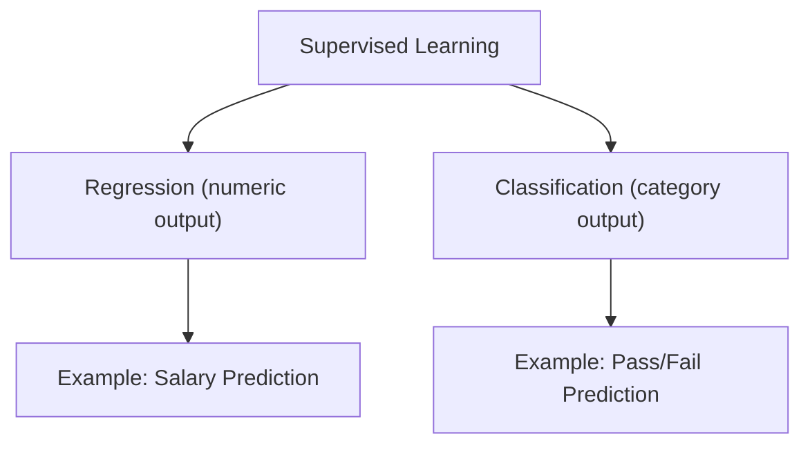
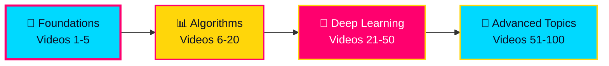

<!-- Animated Header with Gradient -->
<div align="center">


</div>

---

<!-- Status & Info Badges -->
<div align="center">


</div>

---

## 📚 Table of Contents

```
├── 📖 About This Journey
├── 🎬 Video Series Overview
├── 🧠 Key Concepts Map
├── 📝 Detailed Notes
├── 🛠️ Tech Stack & Tools
├── 🚀 Learning Path
└── 📈 Progress Tracking
```

---

## 🎯 Quick Navigation

| 📼 Video | ⏱️ Duration | 🎯 Topic | Status |
|:---:|:---:|:---|:---:|
| **1** | 20:00 | What is Machine Learning? | ✅ |
| **2** | 16:01 | AI vs ML vs DL | ✅ |
| **3** | 27:41 | Types of Machine Learning | ✅ |
| **4** | 11:28 | Batch / Offline Learning | ✅ |
| **5** | 19:27 | Online / Incremental Learning | ✅ |

---

## 🌟 About This Repository

<table>
<tr>
<td align="center">

**What?** 📚

Personal study notes from CampusX's "100 Days of Machine Learning" playlist

</td>
<td align="center">

**Why?** 💡

Building a solid ML foundation + creating a reference guide

</td>
<td align="center">

**How?** 🔧

Hands-on learning + detailed note-taking + practical examples

</td>
</tr>
</table>

```
Playlist URL: https://www.youtube.com/playlist?list=PLKnIA16_Rmvbr7zKYQuBfsVkjoLcJgxHH
Channel: CampusX
Starting Date: March 2021
Current Progress: Videos 1-5 Complete ✨
```

---

## 🎬 Video Series Breakdown

### Video 1️⃣ — What is Machine Learning?

<details open>
<summary><b>📖 Click to expand</b></summary>

**Idea in my own words:**  
Machine Learning = teaching computers to learn patterns from data instead of hardcoding rules.

**My key takeaways:**
- ML builds models from **training data** → makes **predictions**
- Traditional code: `rules + data → output`  
  ML approach: `data + output → model → predictions`

**Real-world examples:**
- 🏥 Medical diagnosis systems
- ✉️ Spam filters
- 🎤 Voice recognition (Siri, Google)
- 📸 Computer vision

**Why this matters:**
Some problems are too complex to hardcode. ML learns from examples instead.

</details>

---

### Video 2️⃣ — AI vs ML vs DL

<details open>
<summary><b>📖 Click to expand</b></summary>

**The Hierarchy:** `AI ⊃ ML ⊃ DL` (big umbrella → smaller subset → even smaller subset)

```
┌─────────────────────────────┐
│  Artificial Intelligence    │  ← Broadest: All smart machines
├─────────────────────────────┤
│  Machine Learning           │  ← Learns from data
├─────────────────────────────┤
│  Deep Learning              │  ← Neural networks + big data
└─────────────────────────────┘
```

**When to use each:**
- **ML:** Structured data, medium datasets, clear patterns
- **DL:** Images, audio, text, massive datasets, complex patterns

**Key insight:**
DL is powerful but needs lots of data. Regular ML is lighter & faster for many tasks.

</details>

---

### Video 3️⃣ — Types of Machine Learning

<details open>
<summary><b>📖 Click to expand</b></summary>

**The 4 Main Categories:**

#### 1️⃣ **Supervised Learning** (I have labeled data)



#### 2️⃣ **Unsupervised Learning** (No labels, find patterns)

- **Clustering:** Group similar items (customer segments)
- **Dimensionality Reduction:** Compress 1000 features → 2-3 features
- **Anomaly Detection:** Find outliers (fraud, defects)
- **Association Rules:** Find "items bought together"

#### 3️⃣ **Semi-Supervised Learning** (Mix of labeled + unlabeled)

Real example: Google Photos
- Label a few photos as "Mom" → system groups all Mom's photos
- Minimal labeling, maximum automation

#### 4️⃣ **Reinforcement Learning** (Learn through rewards)

```
Agent → Action → Environment → Reward/Penalty → Updated Policy
```

Famous example: AlphaGo beating professional Go players

</details>

---

### Video 4️⃣ — Batch / Offline Learning

<details open>
<summary><b>📖 Click to expand</b></summary>

**Definition:** Train once on complete historical data → Deploy static model

**Pipeline:**
```
1. Collect Full Dataset
   ↓
2. Train Model Locally
   ↓
3. Deploy to Production
   ↓
4. Model Stays Static (until manual retrain)
```

**Pros ✅:**
- Simple to understand & deploy
- Works for stable problems
- One-time training cost

**Cons ❌:**
- Needs lots of RAM/compute
- Doesn't adapt to new patterns
- Expensive retraining cycles
- Model ages over time

**Use when:** Problem is stable, you have computational power

</details>

---

### Video 5️⃣ — Online / Incremental Learning

<details open>
<summary><b>📖 Click to expand</b></summary>

**Definition:** Model keeps learning **as new data streams in**

**Flow:**
```
Initial Model + Stream → Incremental Updates → Always Improving
```

**Real-world examples:**
- 🤖 Chatbots & Assistants (ChatGPT, Alexa)
- ⌨️ Keyboard Autocorrect (SwiftKey learns your typing)
- 🎬 YouTube Recommendations (adapts to your watches)
- 🏦 Fraud Detection (catches new scam patterns)

**Key concept: Learning Rate**
- Too high → Forgets old knowledge
- Too low → Too slow to adapt
- Balance = remember past + learn new

**Challenges:**
- Complex monitoring in production
- Risk of "catastrophic forgetting"
- Vulnerable to malicious data
- Needs logging & rollback systems

**Use when:** Problem evolves, continuous data stream, cost-sensitive

</details>

---

## 🛠️ Tech Stack & Tools

<div align="center">


</div>

---

## 📈 Learning Path Roadmap



---

## 🎓 Key Concepts at a Glance

### Understanding ML Fundamentals

| Concept | Simple Explanation | Example |
|:---|:---|:---|
| **Training Data** | Examples with answers | Photos labeled "cat" or "dog" |
| **Model** | Learned pattern from data | Rules that predict from new photos |
| **Features** | Input variables | Image pixels, user behavior |
| **Labels** | Correct answers | "cat" or "dog" category |
| **Prediction** | Model's guess on new data | Predicting if new photo is cat/dog |

### Learning Styles Comparison

```
SUPERVISED          UNSUPERVISED        SEMI-SUPERVISED        REINFORCEMENT
├─ Has labels      ├─ No labels        ├─ Some labels        ├─ Trial & error
├─ Regression      ├─ Clustering       ├─ Google Photos      ├─ Rewards/Penalties
├─ Classification  ├─ Anomalies        ├─ Low-cost           ├─ AlphaGo
└─ Simple          └─ Complex patterns └─ Efficient          └─ Advanced
```

### Batch vs Online: Head-to-Head

| Aspect | **Batch Learning** | **Online Learning** |
|:---|:---:|:---:|
| Training Cycle | Once, then deploy | Continuous |
| Adaptation | Static | Dynamic |
| Complexity | Low | High |
| Monitoring | Minimal | Intensive |
| Cost (per update) | High | Low |
| Best For | Stable problems | Evolving problems |

---

## 📝 My Learning Notes Files

📄 **Available Documents:**

- `ml-study-notes.md` — Full detailed notes with my personal insights
- `README.md` — This file (visual overview)
- `video-summaries/` — Individual video breakdowns (coming soon)
- `code-snippets/` — Python examples (coming soon)

---

## 🚀 How I'm Using These Notes

✅ **As a Quick Reference** — When I need to recall terminology  
✅ **As a Concept Map** — Before diving into code  
✅ **As a Decision Guide** — "Should I use batch or online learning here?"  
✅ **As Interview Prep** — Explaining ML concepts clearly  

---

## 📊 Progress Tracking

```
Video Completion: ████████████████████ 100% (5/5)
Concepts Understood: ██████████████████░░ 90%
Hands-on Practice: ██████████░░░░░░░░░░ 50%
Ready for Next Phase: ████████░░░░░░░░░░░░ 40%

Next Goals:
□ Implement first regression model
□ Build classification classifier
□ Create clustering example
□ Start reinforcement learning basics
```

---

## 🔗 Resources & Links

<table>
<tr>
<td>

**📺 Original Content**
- [CampusX YouTube Channel](https://www.youtube.com/@campusx)
- [100 Days ML Playlist](https://www.youtube.com/playlist?list=PLKnIA16_Rmvbr7zKYQuBfsVkjoLcJgxHH)

</td>
<td>

**🤝 Community**
- [CampusX Discord](https://discord.gg/PsWu8R87Z8)
- [CampusX LinkedIn](https://www.linkedin.com/company/campusx-official)

</td>
<td>

**📚 Learning Tools**
- [Jupyter Notebooks](https://jupyter.org/)
- [Google Colab](https://colab.research.google.com/)
- [Scikit-learn Docs](https://scikit-learn.org/)

</td>
</tr>
</table>

---

## 💡 Tips for Success

> 🎯 **Consistency is key** — Study daily, even for 30 minutes  
> 💻 **Code along** — Don't just watch; implement examples  
> 📝 **Take notes** — Write it in your own words  
> 🔄 **Review regularly** — Revisit complex concepts  
> 🤝 **Join community** — Discuss with other learners  
> 🏗️ **Build projects** — Apply learning to real problems  

---

## 📞 Questions I Still Have

- [ ] How exactly does `partial_fit()` work in online learning?
- [ ] What are production-grade online ML systems like?
- [ ] How do companies monitor deployed models?
- [ ] What's the difference between different frameworks?

---

## 🎨 Markdown Features Used in This README

✨ **Collapsible Details** — Easy to expand/collapse sections  
✨ **Mermaid Diagrams** — Flowcharts & visualizations  
✨ **Shields.io Badges** — Modern status indicators  
✨ **Emoji Integration** — Visual clarity  
✨ **Code Blocks** — Syntax highlighting  
✨ **Tables** — Organized data  
✨ **HTML Divs** — Advanced layout  

---

<div align="center">

### 🌟 Keep Learning, Keep Growing!

Made with 🧠 curiosity + ☕ determination + 💪 passion


---

**Last Updated:** December 16, 2025  
**Progress:** Foundations Complete ✅  
**Next Phase:** Algorithms & Implementation 🔜

</div>